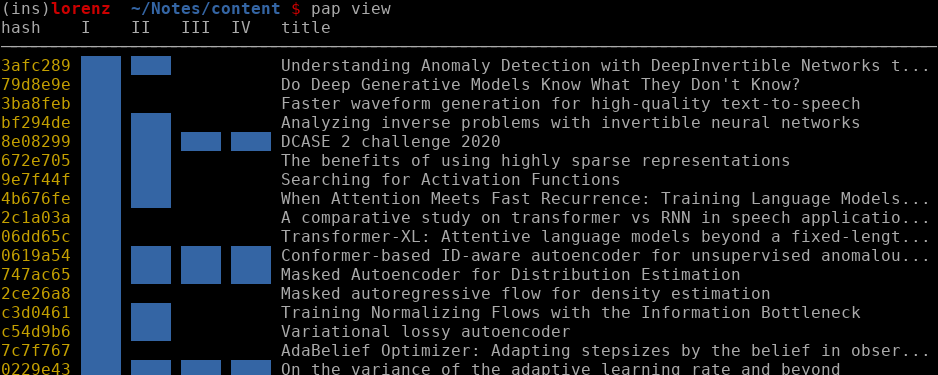

# Paper threading

[](https://crates.io/crates/linfa)

pap is a paper threading tool for the command line. It offers a simple interface for adding metadata and querying reading status. The workflow is opinionated, dividing into four different stages and tailored to the author's use.

</img>

## Installation

You can install `pap` with

```
cargo install pap
```

## How-to use

Currently my reading is comprised of four stages:
 * I  - added but deeper understanding with more references is needed
 * II - read and compressed on a paper or whiteboard
 * III - recalled or explained to somebody else, looked into open-review
 * IV - feed-back from publication venue, textual results or reversed-citation graph

# License

Dual-licensed to be compatible with the Rust project.

Licensed under the Apache License, Version 2.0 http://www.apache.org/licenses/LICENSE-2.0 or the MIT license http://opensource.org/licenses/MIT, at your option. This file may not be copied, modified, or distributed except according to those terms.

